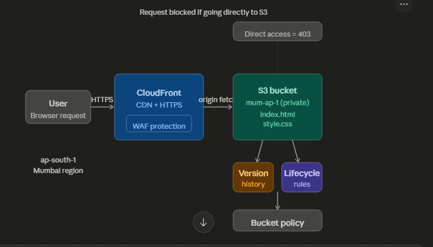

# AWS S3 Static Website with CloudFront

## Project Overview
A static website hosted on AWS S3 and served securely through CloudFront CDN.

## Architecture
User → CloudFront (HTTPS + WAF) → Private S3 Bucket

## Services Used
- **Amazon S3** — Stores and serves website files
- **Amazon CloudFront** — CDN for HTTPS and global delivery
- **AWS WAF** — Web Application Firewall for security

## What I Built

### Intermediate
- Created S3 bucket
- Enabled static website hosting
- Uploaded HTML/CSS website
- Configured public bucket policy

### Advanced
- Made bucket private
- Set up CloudFront distribution with OAC
- Enabled HTTPS access
- Configured versioning for file history
- Added lifecycle rules to auto-archive old versions

## Live URL
https://ERNKLDDRQV5ZL.cloudfront.net

## Lifecycle Rules
- Noncurrent versions move to Standard-IA after 30 days
- Noncurrent versions deleted after 90 days
- Incomplete multipart uploads deleted after 7 days

## Architecture
User → CloudFront (HTTPS + WAF) → Private S3 Bucket

## Architecture diagram
